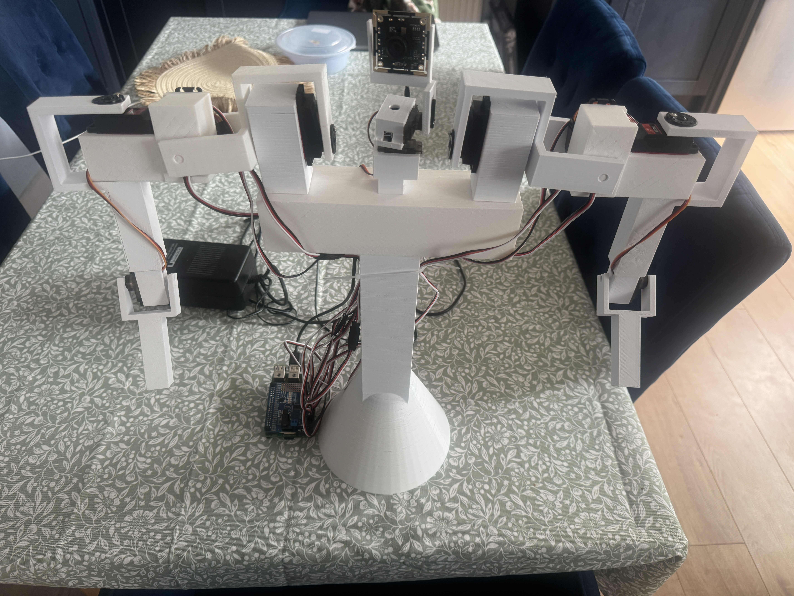
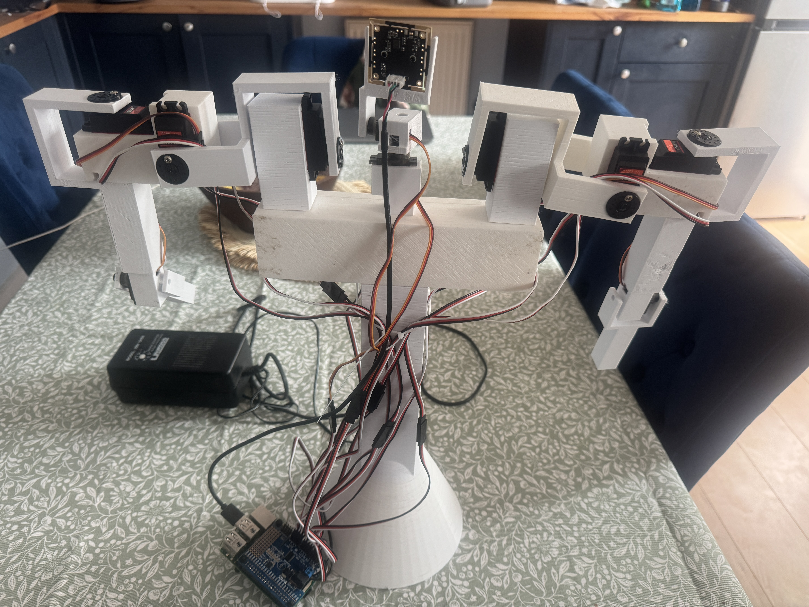
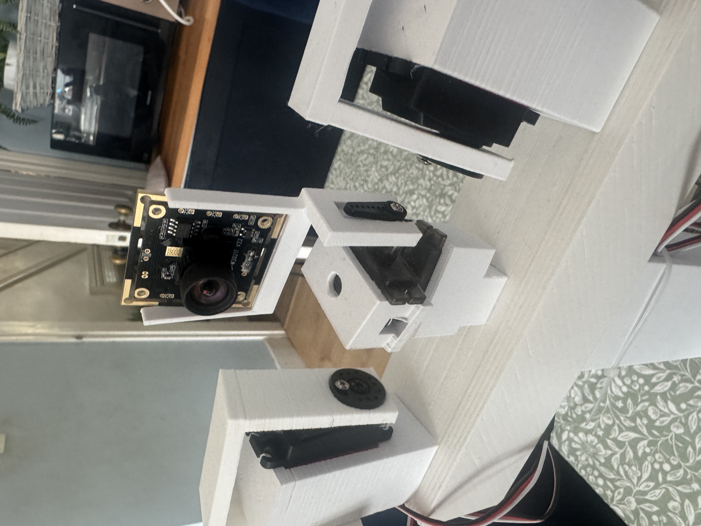
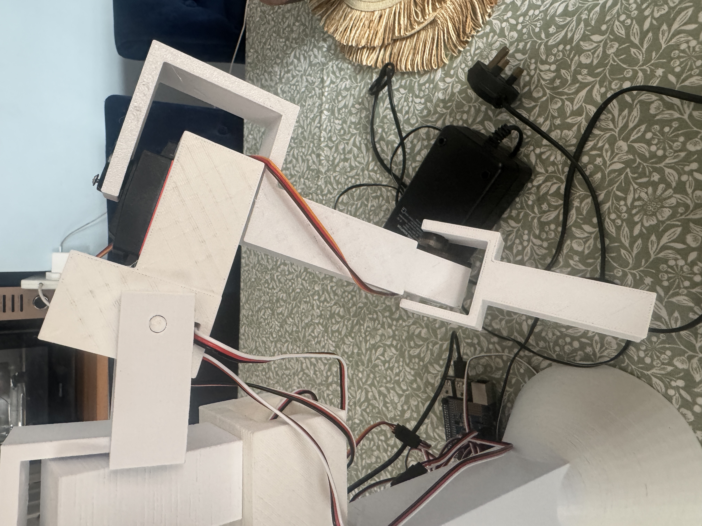
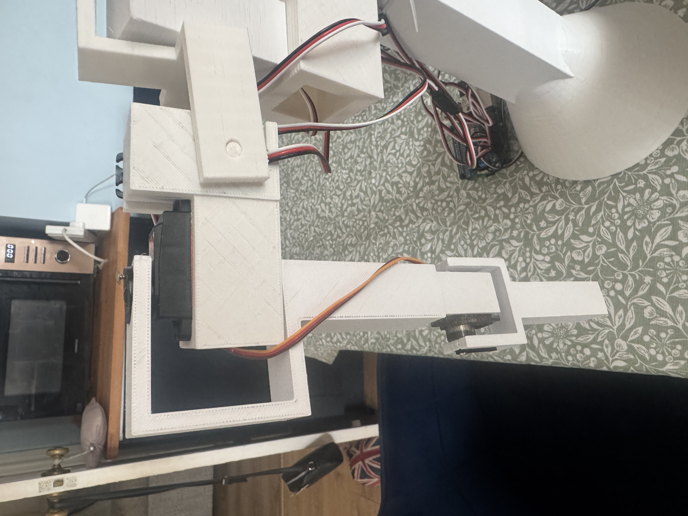

# PiBob

> **Work in Progress** — This is v0.1. The design and software are functional but still evolving. Expect rough edges, and contributions are very welcome!

A cheap, 3D-printable robot you can build for under £100. Powered by a Raspberry Pi with dual arms and a head, controlled via a web interface. PiBob uses an Adafruit PCA9685 servo hat to drive 10 servos, with a Flask web app for real-time control and a live camera feed.




## Features

- **Web UI** — real-time sliders, enable/disable, reverse direction, pulse width tuning
- **Live camera feed** — streamed directly to the web interface
- **16-channel control** — servo, continuous rotation, or raw PWM modes per channel
- **Safe limits** — configurable min/max per channel, persisted to `config.json`
- **Presets** — save and load servo positions
- **Gestures** — pre-programmed movements with smooth interpolation:
  Wave, Point, Run, Scared, Angry, Celebrate, Shrug, Dab, Fight, Dance
- **Sweep test** — automatically sweep all servos through their range
- **PWM frequency** — adjustable from 24–1526 Hz

## Hardware

See [BOM.md](BOM.md) for the full bill of materials. Key components:

- Raspberry Pi (any model with I2C and USB)
- Adafruit PCA9685 16-channel servo HAT
- 4x Miuzei 9G micro servos (head + smaller joints)
- 6x Miuzei DS3218MG 20KG digital servos (arm joints)
- 1x USB camera module
- 3D printed parts (STL files included)

### Channel Mapping

| Channel | Joint | Notes |
|---------|-------|-------|
| CH2 | Head Rotation | Left/right, full range (0-180) |
| CH3 | Head Tilt | Up/down (50-140) |
| CH4 | Right Bicep | 90 = straight, 180 = fully bent |
| CH5 | Right Arm Rotation | Reversed, side-to-side |
| CH6 | Right Shoulder Lift | Reversed, chicken wing style |
| CH7 | Right Shoulder Rotation | Reversed, arm up/down front |
| CH8 | Left Bicep | Reversed, mirrors right |
| CH9 | Left Arm Rotation | Side-to-side |
| CH10 | Left Shoulder Lift | Chicken wing style |
| CH11 | Left Shoulder Rotation | Arm up/down front |

## 3D Printing & Assembly

All STL files are in the [`STL/`](STL/) folder. Parts were designed in TinkerCAD. PLA works fine for all parts.

### Print List

| Part | File | Qty |
|------|------|-----|
| Desktop Base | `Desktop-Base.stl` | 1 |
| Shoulder Beam | `Shoulder-Beam.stl` | 1 |
| Head Bottom Servo Holder | `Head-BottomServoHolder.stl` | 1 |
| Head Middle Servo Holder | `Head-MiddleServoHolder.stl` | 1 |
| Head Camera Holder | `Head-CameraHolder.stl` | 1 |
| Shoulder Top Servo Holder | `Shoulder-Top-ServoHolder.stl` | 2 |
| Shoulder Left Bracket | `Shoulder-Left-Bracket.stl` | 1 |
| Shoulder Right Bracket | `Shoulder-Right-Bracket.stl` | 1 |
| Shoulder Left Servo Holder | `Shoulder-Left-ServoHolder.stl` | 1 |
| Shoulder Right Servo Holder | `Shoulder-Right-ServoHolder.stl` | 1 |
| Arm Bicep | `Arm-Bicep.stl` | 2 |
| Arm Elbow | `Arm-Elbow.stl` | 2 |
| Arm Forearm | `Arm-Forearm.stl` | 2 |

### Assembly: Body

1. Print `Desktop-Base.stl` — this is the main base of the robot
2. Place `Shoulder-Beam.stl` on top of the base to form the main body

### Assembly: Head



1. Fit a small servo into `Head-BottomServoHolder.stl`, then push it into the top of `Shoulder-Beam.stl`
2. Fit another small servo to `Head-MiddleServoHolder.stl`, then attach it to `Head-BottomServoHolder.stl`
3. Slide the USB camera into `Head-CameraHolder.stl` and connect it to `Head-MiddleServoHolder.stl`

### Assembly: Shoulders & Arms

Left and right arms are the same build, except where a Left/Right-specific STL is provided.




1. Print 2x `Shoulder-Top-ServoHolder.stl`, fit servos, then push them into `Shoulder-Beam.stl`
2. Print `Shoulder-Left-Bracket.stl` and `Shoulder-Right-Bracket.stl`, fit servos, and attach to the shoulder top servo holders
3. Print `Shoulder-Left-ServoHolder.stl` and `Shoulder-Right-ServoHolder.stl`, fit servos, and attach to the corresponding shoulder brackets
4. Print 2x `Arm-Bicep.stl` and attach to the shoulder servo holders
5. Print 2x `Arm-Elbow.stl`, fit small servos, and attach to the biceps
6. Print 2x `Arm-Forearm.stl` and attach to the elbows

## Setup

### 1. Install dependencies

```bash
pip install -r requirements.txt
```

### 2. Copy files to the Pi

```bash
scp -r app.py requirements.txt youruser@yourpi.local:~/pibob/
```

### 3. Run

```bash
python3 app.py
```

The web UI will be available at `http://yourpi.local:8080`. To use port 80 (requires root):

```bash
sudo PORT=80 python3 app.py
```

### Running as a service

Create `/etc/systemd/system/pibob.service`:

```ini
[Unit]
Description=PiBob Servo Control
After=network.target

[Service]
ExecStart=/usr/bin/python3 /home/youruser/pibob/app.py
WorkingDirectory=/home/youruser/pibob
Restart=always
User=root

[Install]
WantedBy=multi-user.target
```

Then:

```bash
sudo systemctl enable pibob.service
sudo systemctl start pibob.service
```

## API

All endpoints accept JSON via POST.

| Endpoint | Description |
|----------|-------------|
| `GET /` | Web UI |
| `POST /set` | Set channel value `{channel, value, mode}` |
| `POST /mode` | Change channel mode `{channel, mode}` |
| `POST /enable` | Enable/disable channel `{channel, enabled}` |
| `POST /reverse` | Toggle reverse `{channel, reversed}` |
| `POST /pulse` | Set pulse width range `{channel, min_pulse, max_pulse}` |
| `POST /config` | Update channel name/limits `{channel, name?, safe_min?, safe_max?}` |
| `POST /frequency` | Set PWM frequency `{frequency}` |
| `POST /gesture` | Run a gesture `{name}` |
| `POST /sweep` | Start/stop sweep `{active}` |
| `GET /state` | Get current state of all channels |
| `POST /presets/save` | Save preset `{name, state}` |
| `POST /presets/load` | Load preset `{name}` |
| `POST /presets/delete` | Delete preset `{name}` |

## Contributing

Contributions are welcome! Feel free to open issues or submit pull requests.

## License

This project is licensed under the MIT License — see [LICENSE](LICENSE) for details.
