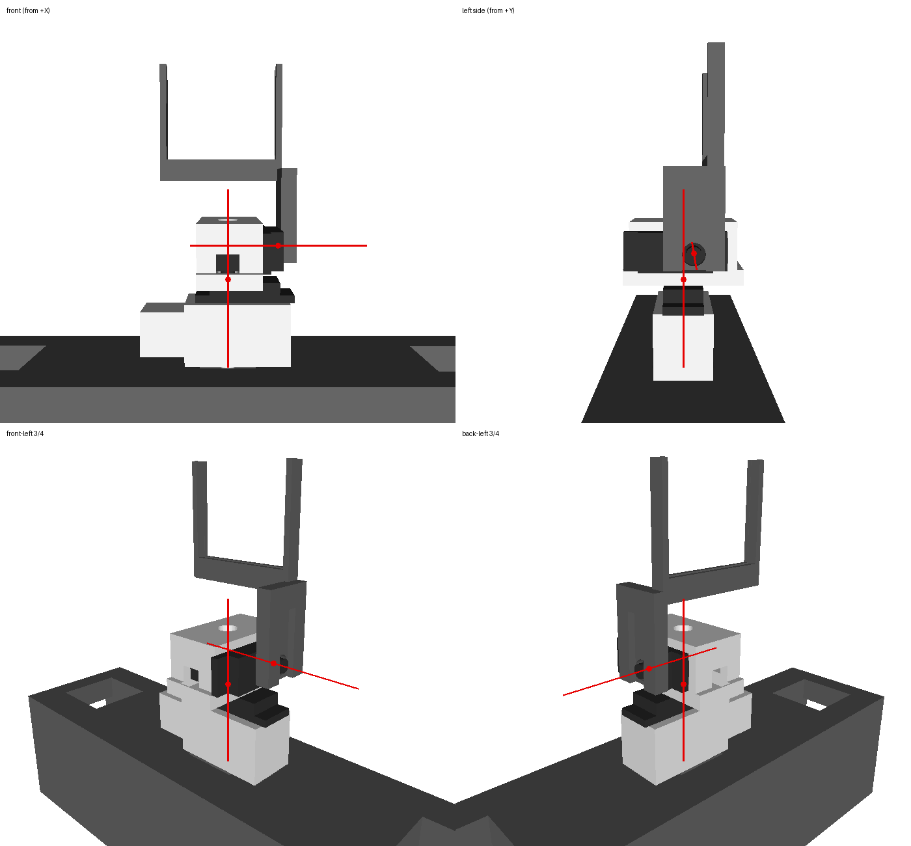

# PiBob → Fusion 360 assembly

Opens PiBob in Fusion 360 as a jointed assembly generated from the URDF
(`ros2/pibob_description/urdf/pibob.urdf.xacro`). Each joint rotates about the
same pivot and axis as in the URDF, with the URDF limits. `verify/` checks this
against RViz.

```
fusion/
  urdf_to_fusion_data.py        URDF (xacro) -> pibob_fusion.json          (runs on the Mac)
  pibob_fusion.json             generated; committed so Fusion works without Python
  PiBobAssembly/                the Fusion 360 script (PiBobAssembly.py + .manifest)
  preview_pose.py               poses/renders PiBob from the JSON alone (same motion as Fusion)
  verify/                       RViz comparison, mock-Fusion dry run, comparison PNGs, results.json
```

## Run it

1. **Regenerate the JSON** (needed only after the URDF changes; the committed copy matches `main`):
   ```bash
   uv run --with xacro --with numpy fusion/urdf_to_fusion_data.py
   ```
2. **Install the script in Fusion:** open **Utilities → Add-Ins → Scripts and Add-Ins**
   (or press Shift+S). Next to *My Scripts*, click **+**, choose
   `PiBob/fusion/PiBobAssembly`, then select **PiBobAssembly** and click **Run**.
   Fusion runs the script from where it sits in the repo. The script looks for
   `../pibob_fusion.json`, and the STLs are found through relative paths from the
   JSON (`../ros2/pibob_description/meshes/*.stl`). Keep `fusion/` inside the repo
   checkout. If you move it, the script asks you to pick the JSON, and it also
   accepts STLs copied into `fusion/meshes/`.
3. **Wait a few seconds.** A new untitled design opens. When the script finishes,
   a message box shows the joint self-check (see below). The same report is saved
   as `fusion/fusion_check.txt`.
4. **Save it:** use **File → Save** to store it in your Fusion hub, or
   **File → Export → .f3d** to get a local file.

## What you get

- **One component per URDF link** (16 of them: `base_link`, `shoulder_beam`, head ×4,
  and 5 per arm). Every link component sits at the link's zero-pose frame, so its
  **origin is the URDF joint pivot**.
- Inside each link component there is **one sub-component per URDF `<visual>`**,
  named `<link>__<Part>`, for example `r_upper_arm_link__Arm-Bicep`. It is placed at
  the visual `<origin>` and holds the STL as a mesh body, imported in mm inside a
  Base Feature. `upper_arm_link` has three sub-components: the bicep, the fixed
  elbow and the elbow servo. `camera_link` has none; it's just a frame. The sub-components are *Ground to Parent*, so they move with their link.
- **As-built joints** (nothing jumps when they're created):
  - 10 revolute joints, each about the URDF axis through the URDF pivot. Each has
    min/max limits from the URDF and **no rest value**, because a rest value makes
    joints snap back after a drag. Drive them with *Drive Joints*, a *Motion Study*,
    or by dragging.
  - 5 rigid joints for the URDF `fixed` joints. `base_link` is the only grounded
    occurrence.
- **How a revolute joint is built.** Every link component gets a construction
  sketch `<joint>_axis`. It holds a 20 mm construction line starting at the
  component origin (the pivot) and running along the URDF axis, sign included, so
  a −Y axis is drawn towards −Y. The joint is then
  `JointGeometry.createByCurve(line, StartKeyPoint)` with `ZAxisJointDirection`.
  The origin is the start of the line and the rotation axis runs along it. If the
  self-check finds that axis wrong, the script deletes the joint and rebuilds it as
  `createByPoint(child origin)` with `X/Y/ZAxisJointDirection`. It keeps whichever
  version passes, and the report shows which one was used (`[axis-line]` or
  `[point+XYZ]`).
- **Joints use only sketch and construction geometry.** Nothing references a mesh
  or a BRep face or edge.

### Joint self-check (runs automatically in Fusion)

After building, the script drives each revolute joint to 0.3 rad and reads the
child occurrence's world transform before and after. From that it works out the
**real** rotation axis and angle, and checks:

- **Axis error:** the angle between the real axis and the URDF axis. Anything
  over 5° is flagged `WRONG` and triggers the rebuild described above.
- **Pivot drift:** must be within 0.1 mm.
- **Angle turned:** must be 0.3 rad.

It also checks the sign. If Fusion's positive direction is opposite to the URDF's,
it flips that joint's limits and says `Fusion + = URDF -`. Every joint is then set
back to 0. The report is saved as `fusion/fusion_check.txt`.

`NO UPDATE` means Fusion didn't report the move through the API. The self-check
can't judge that joint, so trust *Drive Joints* instead.

## Troubleshooting (found in real Fusion)

- **Joints turn about the wrong axis.** This happened on the first real run:
  the elbow swung left–right instead of up–down, and the shoulder joint next to
  the head did the same. The original build used `createByPoint` plus
  `CustomJointDirection` with a construction-axis proxy. Fusion ignored the custom
  direction and turned the joint about the point's default Z. It's fixed by the
  axis-line construction above, with the point+XYZ fallback. The self-check now
  measures the real axis, so this can't pass silently again. If a joint still
  reports `WRONG` after both attempts, delete the joint and redo it by hand: pick
  the start point of the link's `<joint>_axis` sketch line.
- **Joints snap back after you drag them.** The first build enabled a rest value
  of 0. Rest values are now off. Only the min/max limits are set.

## Arm pivots: on the pins, from the meshes

Every arm joint origin used to be a hand-tuned guess. `shoulder_lift` was 14 mm off
its pin and `arm_rot` was 19 mm off, so parts swung about empty space. Each joint
origin now sits **on the physical rotation feature found in the STLs**, and the
parts have **not moved**: every visual and child-joint origin was re-expressed
against the new joint frame. Zero-pose vertex displacement vs the previous URDF is
**0.0 mm** (`verify/pin_check.py --ref <old json>`).

**What the meshes contain.** `verify/pin_check.py` fits circles to the curved facets
of every STL and classifies each as a boss or a hole from the facet normals:

- **DS3218 holders** (Shoulder-Top-ServoHolder, Shoulder-L/R-ServoHolder) each carry
  a **Ø5.8 × 6.1 mm pin coaxial with the servo shaft**. On the top holder the pin is
  9.5 mm from the end of the 40.2 × 20.5 mm DS3218 pocket, which is the DS3218
  shaft offset.
- **Driven U-brackets** (Shoulder-L/R-Bracket, Arm-Bicep) have, all coaxial: a
  **Ø21 × 2.3 mm horn seat plus a Ø9 hub hole** on one arm, and a **Ø6 pin hole** on
  the other.
- **The 9 g elbow** has a Ø4.7 pin on Arm-Elbow, coaxial with the modelled
  servo's Ø4.8 spline. Arm-Forearm has a Ø7 hub hole and a Ø5 pin hole.

Each joint origin is the pin's root centre (where it leaves its holder). The axis
is the pin axis, **0.000° from the URDF axis in every case**, so the axis signs and
limits are unchanged.

| joint (L = R mirrored) | pin | old → new origin, world mm | moved by, mm | origin → pin axis |
|---|---|---|---|---|
| shoulder_rot | Shoulder-Top-ServoHolder Ø5.8 | (0, ±85, 365) → (0, ±98.45, 369.9) | 14.3 | 0.000 mm |
| shoulder_lift | Shoulder-ServoHolder Ø5.8 (X) | (0, ±145, 385) → (−13.45, ±154.5, 374.55) | 19.5 | 0.000 mm |
| arm_rot | Shoulder-ServoHolder Ø5.8 (Z) | (4, ±225, 340) → (3.55, ±205.6, 394.45) | 57.8 | 0.000 mm |
| bicep | Arm-Elbow Ø4.7 (+ servo spline) | (4, ±225, 260) → (4, ±218.5, 259.9) | 6.5 | 0.000 mm |
| head_pan / head_tilt | 9 g servo spline Ø4.8 | unchanged | 0 | 0.000 mm |

**The mating part's hole is not always on the pin: seating errors in the URDF.**
Holding the pin still, `pin_check.py` sweeps each joint (up to ±45° within limits)
and measures how far the other part's pin hole moves. It also measures how far that
hole sits off the pin axis at zero pose:

| joint | hole off pin axis at zero pose | hole drift over the sweep | what that means |
|---|---|---|---|
| head_pan, head_tilt | 0.00 mm | 0.00 mm | concentric ✔ |
| shoulder_lift | bracket's Ø6 / Ø9 / Ø21 are 9.5 mm off the holder pin | 0.0 mm (the child owns the pin) | the pin sits inside the bracket wall |
| shoulder_rot | bracket's Ø6 / Ø9 / Ø21 are 5.6 mm below the top-holder pin | 4.3 mm | bracket seated 5.6 mm too low |
| arm_rot | bicep's Ø6 / Ø9 / Ø21 are 0.8–0.9 mm off | 0.64 mm | small |
| bicep | forearm's Ø5 / Ø7 are 1.1 mm above the elbow pin | 0.84 mm | small |

These are part-placement errors, not pivot errors. The joints now turn about the
pins, but the bracket (shoulder_rot) and the servo holder (shoulder_lift) were seated
by eye 5.6 mm and 9.5 mm away from where their holes meet the pins. No 180° flip
of either part fixes it; I tested all three. Re-seating them means translating the
part perpendicular to the axis, which *does* move geometry at zero pose, so it isn't
applied here:

- bracket visual only (in `*_shoulder_rot_link`): +5.6 mm Z;
- shoulder servo holder and everything below it (`*_shoulder_lift_link` subtree):
  3.3 mm towards the body centre and −3.45 mm Z, onto the bracket's (re-seated)
  holes;
- bicep, elbow and forearm (`*_upper_arm_link` subtree): about (0.5, 0.7, 0) mm onto
  the holder pin;
- forearm (`*_forearm_link`): −1.1 mm Z.

Close-ups: `verify/pins/<joint>.png` shows lower limit / 0 / upper, only the two
parts at the joint, looking down the pin. The red dot and line mark the pin axis
through the joint origin. The green ring is the child's pin hole, slid into the
pin's plane. Numbers are in `verify/pin_check.json`.

## The head: servos and where the pivots come from

The original head joint origins were rough guesses, and the three head parts
floated with gaps. The head is now seated from the holder STL geometry, with a 9 g
servo modelled in each servo pocket.

**Servo size, from the meshes.** Head-BottomServoHolder, Arm-Elbow (the same part),
and Head-MiddleServoHolder each have a rectangular servo pocket:

| holder | pocket L × W × depth | other features |
|---|---|---|
| Head-BottomServoHolder / Arm-Elbow | 23.0 × 12.2 × 17.25 mm, open on one face | cable slot at one end; Ø4.7 pivot pin on the opposite face, **coaxial with a shaft 5.85 mm from the pocket end** |
| Head-MiddleServoHolder | 23.0 × 12.1 × 18.0 mm, open to one side | cable slot at one end; Ø7 hub hole and a 7 mm-wide horn groove in its floor |
| Head-CameraHolder | none | side arm with a Ø7 hub hole and a 7 mm horn groove on its outer face |

A 23 × 12.2 mm pocket is an **SG90 / MG90S-class 9 g micro servo**: 22.8 × 12.2 mm
body, 32.2 mm tab span, output spline Ø4.8. That agrees with the BOM ("4 × Miuzei 9G":
head pan, head tilt, and the two elbows). The model `ros2/pibob_description/meshes/Servo-9g.stl`
comes from `ros2/pibob_description/scripts/make_servo_stl.py`. It's a body box, a
tab plate and a spline. Its origin is **on the output shaft at the body's top face**,
so a servo visual's `<origin>` in the URDF *is* the shaft axis. The shaft offset
(5.85 mm) is taken from the holder pin; the tab height (16 mm) is the datasheet value.

The xacro gets a reusable `<xacro:servo_9g xyz rpy/>` visual macro, used 4 times:
pan, tilt, and both elbows. The six DS3218 arm servos aren't modelled. The arms
were already right and no arm joint moved. The elbow servos drop in because the
elbow holder is the same part: the elbow servo shaft lies on the bicep axis to
0.1 mm.

**How the head stacks** (derived from the mating features, and matching the photos
in `Images/`):

1. `head_base_link` (new, fixed to the beam) holds Head-BottomServoHolder with
   its **pocket facing up**. Its bottom face sits on the beam top, and its pivot
   pin drops into the beam's 20 × 20 mm head hole. The **pan servo** stands in the
   pocket with its tabs on the holder's top face.
2. `head_pan_joint` is on the pan servo's shaft axis at its top face, 62.2 mm above
   the beam centre (was 45 mm, a guess).
3. `head_pan_link` holds Head-MiddleServoHolder. The floor's hub hole is on the pan
   shaft, and its underside sits on the pan servo's top face. The **tilt servo**
   sits in its side pocket with the shaft pointing to the robot's left. This link
   used to carry the bottom holder, which doesn't turn with pan.
4. `head_tilt_joint` is on the tilt servo's shaft axis at its top face:
   (−3.15, 17.2, 11.05) mm from the pan pivot (was (0, 0, 30) mm, a guess).
5. `head_tilt_link` holds Head-CameraHolder. The side arm's hub hole is on the
   tilt shaft and its inner face sits on the tilt servo's top face. `camera_link`
   is a fixed frame at the centre of the camera board. Before, the camera holder
   was the only part on the tilt side and the middle holder turned with tilt.

Checks (`preview_pose.py --servo-check / --contact-check / --pivot-check`, also in
`verify/results.json`):

- Pan and tilt pivots are **0.000 mm off their servo's shaft axis, 0.000 mm from its
  top face, 0.000° axis error**. Each also sits in the Ø7 hub hole of the part it
  drives, 3.5 mm from the part's surface (the hole radius).
- These contact pairs all have a **0.0 mm gap** (the last is 0.002 mm): beam ↔
  bottom holder, bottom holder ↔ pan servo, pan servo ↔ middle holder, middle
  holder ↔ tilt servo, tilt servo ↔ camera holder.
- The camera holder clears the middle holder by more than 6 mm across the whole
  tilt range (−40° to +50°).

**Head vs the photos (checked again, from a Fusion user's viewpoint).** Nothing
floats and nothing interpenetrates by more than 0.2 mm at zero, pan ±90° or the
tilt limits. Every head contact is 0.0 mm. There are two visible differences from
`Images/Front.JPG`, `Back.JPG` and `Head.JPG`, and **neither can be fixed from the
repo STLs**:

1. The printed head base has a peg going down into the beam. This STL's peg is on
   the end face at a right angle to its servo pocket, so with the pan shaft
   vertical the peg points sideways.
2. The photos suggest the printed middle holder is taller than wide, with the
   tilt servo standing upright. The STL is a 38 × 20 × 20 box whose pocket runs
   front-to-back under its Ø7 top hole.

The printed head parts look like a different revision from the STLs in
`STL/` and `meshes/`. Export the current head parts and they can be dropped in
(see *Editing / swapping a part*); the pivots follow their hub holes.

**One thing to check on the robot.** In this orientation, Head-BottomServoHolder's
square peg (the end that, on the elbow, plugs into the bicep) sticks out
**sideways**, to the robot's right, just above the beam. The photos show the printed
head base with a peg going *down* into the beam, which this STL can't do while its
pocket faces up. Either the head-base STL in the repo differs from the printed one,
or the peg is unused on the head. The pivots don't depend on it: they come from the
servo and hub features, which all agree. If the printed part differs, export it
and swap it in (see below).



## Editing / swapping a part

The joints use only link-component construction geometry, so you can replace a
part's geometry without breaking any joint:

1. Expand the link component, for example `r_upper_arm_link`, then its part
   sub-component, for example `r_upper_arm_link__Arm-Bicep`.
2. **Activate the part sub-component** and insert the new body into it, from a
   STEP/f3d via *Insert → Insert Derive / Insert into current design*, or by modelling
   it there directly. The sub-component's frame **is the STL's native frame**, the
   coordinates the part was modelled in. A STEP export of the same TinkerCAD or
   Fusion part therefore lands in the right place without any moving.
3. Delete the old mesh body. The joints are unaffected. Drive a joint to confirm.
4. If the new part is modelled in a different frame, move the *body* inside the
   part sub-component. Don't move the link component: its origin is the pivot.

To change a **pivot or axis**, edit the URDF, regenerate the JSON and re-run the
script. Moving a link component's origin in Fusion moves the pivot.

**Mesh bodies are not editable solids.** They are fine for rendering, interference
checks and motion studies, but you can't fillet, shell or sketch on them.
*Mesh → Convert Mesh* (prismatic/faceted, and it may need the mesh repaired first)
only suits simple, low-poly parts. Most of PiBob's printed brackets are
TinkerCAD-simple, so they may convert. The practical route for real edits is
still to re-export the original parts as STEP from TinkerCAD and swap them in as
above.

## Verification (what was checked, and how to re-run it)

All of these come from the same `pibob_fusion.json` the Fusion script reads.

1. **Numeric TF match with RViz.** `verify/run_verification.py` drives the
   `pibob-rviz` container's `/joint_states` (its `rviz_reference.py` replaces the
   slider GUI) at 12 poses: zero, each revolute joint alone at +45° (±20° for
   `shoulder_lift`, its limit), and one combined 10-joint pose. At each pose it
   compares every link's TF from `robot_state_publisher` with
   `preview_pose.pose_world()`. `pose_world()` rotates each child subtree about
   the joint's world pivot and axis, which is exactly what a Fusion revolute joint
   does. **Result: max error 0.0000 mm / 0.0000° for every link in every pose**
   (including the reworked head).
2. **Visual match.** For each pose it screenshots RViz and renders the preview from
   the same camera (RViz Orbit model, 45° FOV). It saves
   `verify/<pose>.png` as *preview | RViz | overlay* for two views. For zero,
   head_pan +45° and head_tilt +45° there are also head close-ups (front, and side
   over the left shoulder) in `verify/<pose>_head.png`. In the preview, the moving
   subtree is orange and the pivot and axis are red. In the overlay, red is preview
   only and cyan is RViz only. **Silhouette IoU is 0.992–0.996 in every pose and
   view, and 0.997–0.998 for the head close-ups.** The remainder is edge
   anti-aliasing: no part detaches and nothing is mirrored.
   `verify/head_closeup.png` is a head-only sheet with the pan and tilt axes drawn.
3. **Mock-Fusion dry run.** `verify/mock_fusion_run.py` runs `PiBobAssembly.py`
   against a small mock of the adsk API that includes an as-built-joint solver. It
   checks that:
   - the script runs end to end;
   - every mesh vertex lands where the preview puts it: **0.000000 mm** at zero and
     at the combined pose, driven through the mock joints;
   - the self-check and limit-sign logic work under **both** Fusion sign conventions;
   - with the real-Fusion wrong-axis bug injected, the self-check flags every
     non-vertical joint;
   - when only the axis-line construction is broken, the fallback rebuild fixes
     every joint and the pose matches to 0.000000 mm.

   It proves our code and maths, not that real Fusion accepts each call. The
   mock passed before the first real-Fusion run too, and that run still hit the
   wrong-axis bug.
4. **Pivot vs servo holder** (`preview_pose.py --pivot-check`). This is the distance
   from each joint pivot to the nearest surface of the parent-side and child-side
   meshes, plus how far the pivot is outside the part's bounding envelope (0 means
   it's within the part, for example in its servo pocket, which is empty space in
   the STL):

   | joint | parent part: surface / outside envelope | child part: surface / outside envelope |
   |---|---|---|
   | head_pan | beam + bottom holder + **pan servo** 0.0 / 0 mm | Head-MiddleServoHolder 3.5 / 0 mm (in its hub hole) |
   | head_tilt | middle holder + **tilt servo** 0.0 / 0 mm | Head-CameraHolder 3.5 / 0 mm (in its hub hole) |
   | shoulder_rot / lift / arm_rot / bicep | see *Arm pivots* above: each origin is on its pin, 0.000 mm | |

   The "parent part" now counts every link fixed to the parent. For example, the pan
   servo lives in `head_base_link`, which is fixed to the beam. The head pivots sit
   on their servo's top face. The arm pivots now sit on their pins.
   (Correction: an earlier version of this README called the 20–25 mm
   `shoulder_lift` / `arm_rot` distances "servo pockets". They were real pivot
   errors.)

Re-run everything:

```bash
./ros2/docker/dev.sh     # or: docker run -d --name pibob-rviz -p 6080:6080 pibob-ros2-rviz:humble
uv run --with numpy --with trimesh --with pillow fusion/verify/run_verification.py
uv run --with numpy --with trimesh --with pillow fusion/verify/mock_fusion_run.py
uv run --with numpy --with trimesh --with pillow fusion/preview_pose.py --pivot-check
uv run --with numpy --with trimesh --with pillow fusion/preview_pose.py --servo-check
uv run --with numpy --with trimesh --with pillow fusion/preview_pose.py --contact-check
git show <old-commit>:fusion/pibob_fusion.json > fusion/verify/_ref.json   # optional, for the zero-pose diff
uv run --with numpy --with trimesh --with pillow fusion/verify/pin_check.py --ref fusion/verify/_ref.json
```

The container must include the current URDF and `Servo-9g.stl`. After changing
either, rebuild the image (`./ros2/docker/dev.sh --build`).

`run_verification.py` replaces the container's slider GUI with its own
publisher. Restart the container to get the sliders back.

## Uncertain Fusion API spots (look here first if it errors)

The script was written against the documented API but has **not** been run in real
Fusion. Each of the following is wrapped or reported where possible:

1. **`comp.meshBodies.add(path, MeshUnits.MillimeterMeshUnit, baseFeature)` inside
   `baseFeature.startEdit()/finishEdit()` on a non-root, non-active component.** This
   is the mesh import. If it fails, try activating the component first, or switch
   the design to Direct (`design.designType = DirectDesignType`). In a Direct design
   the base feature isn't needed.
2. **`asBuiltJoints.createInput(child, parent, None)` for rigid joints.** The docs
   say geometry is optional for rigid joints. The script falls back to the child's
   origin point if Fusion rejects `None`.
3. **`JointGeometry.createByCurve(sketchLineProxy, StartKeyPoint)` plus
   `ZAxisJointDirection`.** This assumes a straight curve's joint Z runs along the
   line. The self-check verifies it, and if it's wrong the joint falls back to
   `createByPoint` with `X/Y/ZAxisJointDirection`. (`CustomJointDirection` with a
   construction-axis proxy was **proven not to work**; see Troubleshooting.)
4. **`jointMotion.rotationValue` updating `occurrence.transform2` immediately**
   during the self-check. The script calls `adsk.doEvents()` after setting the
   value. If the transform doesn't update, the report says `NO UPDATE`. The joints
   are probably still fine, so check them with Drive Joints.
5. **`occurrence.isGroundToParent`** on the part sub-occurrences (wrapped in
   try/except, so it's cosmetic). Without it you could drag a part away from its
   link by hand.
6. **The manifest** uses `"autodeskProduct": "Fusion"`, which current Fusion writes.
   Very old builds expected `"Fusion360"`.
7. Units: all API lengths are **cm** (metres × 100, done in `matrix_from_json`).
   Matrices are filled with `setCell(row, col)`, so there is no row- or
   column-major ambiguity. Angles are radians.

## Known limits

- STLs import as mesh bodies. See *Editing / swapping a part*.
- There are no materials or appearances. URDF colours are in the JSON (`rgba`) but
  aren't applied.
- Collisions and inertias aren't used, since the URDF has none.
- The Fusion model is the URDF's zero pose, which is PiBob's home pose (every servo
  at 90°).
